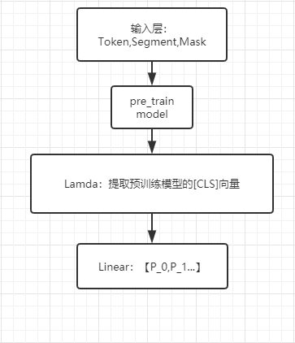

# CCL2019-Chinese-Humor-Computation 1st place solution 
### 运行
	1.在pretrain下生成预训练模型
	
	2.添加任务数据到对应路径，并在路径下运行preproces.py，生成训练数据
	
	3.任务一和任务二分别运行run_bert.sh和run_bert_cls3.sh，生成任务模型以及模型预测 

	4.选取不同的预训练模型和预测结果，运行F1.py和F2.py进行模型融合，生成最终预测结果

### 赛题介绍
	幽默是一种特殊的语言表达方式，在日常生活中扮演着化解尴尬、活跃气氛、促进交流的重要角色。
	而幽默计算是近年来自然语言处理领域的新兴热点之一，其主要研究如何基于计算机技术对幽默进行识别、分类与生成，具有重要的理论和应用价值。
	子任务一：生成幽默识别 **F1**
	该子任务是二分类任务，标签有：生成幽默（label=0）、非生成幽默（label=1）。任务采用F1值进行评价
	子任务二：中文幽默等级划分 **MacroF**
	该子任务是三分类任务，标签有：弱幽默（label=1）、普通幽默（label=3）、强幽默（label=5）。任务采用宏平均（Macro-Average）进行评价。宏平均首先对每一个类统计评价指标值
	队伍最终的得分由两个子任务的得分综合决定，即：
	Score=0.6*子任务一得分+0.4*子任务二得分
### 赛题分析
	两个子任务均是分类任务，按照传统的思想，按照以下步骤进行
	1.预训练
	2.传统模型/BERT等模型训练与调试
	3.local CV 验证
	4.模型向下接网络层
	5.模型融合
	6.其他trick
	*对于本题，task1区分度较task2大，任务得分权重较大0.6，task2*0.4，针对任务，应该优先优化task1
	*本团队在任务进行当中，发现两个任务存在上下游的关系，尝试使用多任务联合学习，并使用任务二的数据对任务一进行数据扩充，取得了明显的效果。
###  further pre-train BERT or other models on within-task training data and in-domain data
	#####在pretrain下生成预训练模型
      1.通过datapro.py对数据进行处理，每段话从中间断开分成两句话，每段话之间用空白行隔开，针对ccl2019幽默度比赛task1和task2，生成了
      cclhumortask12_bert.txt，以及加上去年ccl幽默度得比赛数据和我们自行对task1数据翻译生成得到得数据，生成了cclhumortaskalldata_bert.txt
      2.通过运行prepocess.py对cclhumortask12_bert.txt和cclhumortaskalldata_bert.txt这两份数据分别在chinese_L-12_H-768_A-12、bert_wwm、bert_wwm_ex
      、roberta四个中文预训练模型处理得到了8个文件夹
      pytorchmodeltask12_bert_1005 
      pytorchmodeltask12_roerta_1005 
      pytorchmodeltask12_wwm_1005 
      pytorchmodeltask12_wwm_ex_1005 
      pytorchmodeltaskalldata_bert_1005 
      pytorchmodeltaskalldata_roerta_1006 
      pytorchmodeltaskalldata_wwm_1005 
      pytorchmodeltaskalldata_wwm_ex_1005 
      3.运行finetune_on_pretrain.py针对上述生成得8个文件夹分别进行预训练，为了不产生太多的文件夹最终生成的pytorch预训练模型也放在了上面8个文件夹中
### fine-tune
	用bert等事先训练好的预训练模型，采用输出的[CLS]token的向量作为特征，向下接线性分类层。 
### 模型结构

### 融合策略
	对于cv内的每个模型，分别在其预留验证集上对结果进行微调，找到最佳的分类阈值，并用在测试集的预测结果。综合所有模型的微调结果，投票生成最终预测。 
### Multi-task learning（实验中）
	为什么多任务学习有效

	定义两个任务A和B, 两者的共享隐藏层用F表示。
	隐式数据增加机制. 多任务学习有效的增加了训练实例的数目. 由于所有任务都或多或少存在一些噪音, 同时学习到两个任务可以得到一个更为泛化的表示. 如果只学习任务A要承担对任务A过拟合的风险, 然而同时学习任务A与任务B对噪音模式进行平均, 可以使得模型获得更好表示F；
	注意力集中机制. 若任务噪音严重, 数据量小, 数据维度高, 则对于模型来说区分相关与不相关特征变得困难. 多任务有助于将模型注意力集中在确实有影响的那些特征上, 是因为其他任务可以为特征的相关与不相关性提供额外的证据；
	窃听机制. 对于任务B来说很容易学习到某些特征G, 而这些特征对于任务A来说很难学到. 这可能是因为任务A与特征G的交互方式更复杂, 或者因为其他特征阻碍了特征G的学习. 通过多任务学习, 我们允许模型窃听, 即任务A使用任务B来学习特征G；
	表示偏置机制. 多任务学习更倾向于学习到一类模型, 这类模型更强调与其他任务也强调的那部分表示. 由于一个对足够多的训练任务都表现很好的假设空间, 对来自于同一环境的新任务也会表现很好, 所以这样有助于模型展示出对新任务的泛化能力；
	正则化机制. 多任务学习通过引入归纳偏置起到与正则化相同的作用, 它减小了模型过拟合的风险, 降低了拟合随机噪声的能力。

### 提升细节：
	task1：
		加入任务二数据 +0.04
		调整各类损失权重 +0.02
		融合模型时学习最佳分类阈值 +0.02 
	task2：
		调整各类损失权重 +0.01
		融合模型时学习最佳分类阈值 +0.01
		不同batch_size训练模型融合 +0.02 
		
### 结果对比

pre_train model  | task1_f1  | task2_macro_f1
 ---- | ----- | ------  
 bert  | None | 0.503133
 bert_wwm  | 0.942984 | 0.506136 
 bert_wwm_ex  | 0.943652 | 0.504205 
 robert  | 0.938531 | 0.499418 
 bert_alldata  | 0.942954 | 0.506015 
 bert_wwm_alldata  | 0.943523 | 0.508253 
 bert_wwm_ex_alldata  | 0.943664 | 0.503712 
 robert_alldata  | 0.940684 | 0.498161 
 
